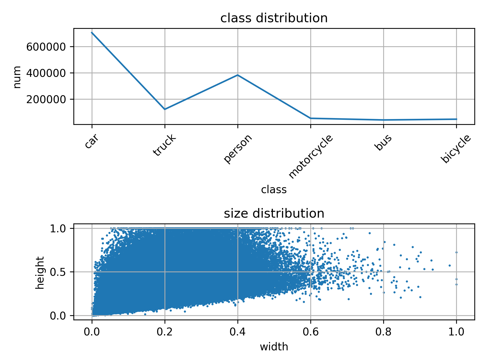

# Class_bbox_distribution

## :fire:Explanation
It visually shows the distribution of class or distribution of the width and height fo annotated bbox.

### input data
* XML used as PASCAL VOC annotation format

## :star:Results
<figure>
        
</figure>